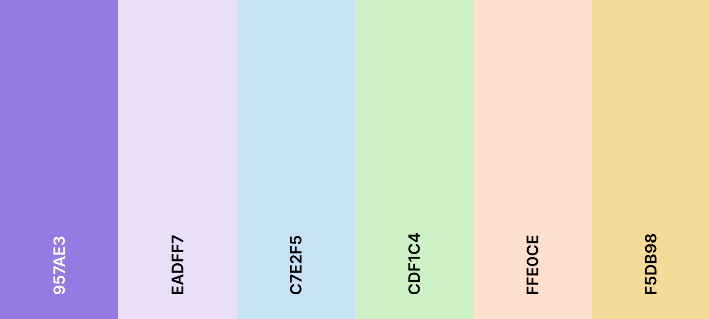

# Parfumier <!-- omit in toc -->

> An app that allows users to create a profile, edit it, add their profile image and interact with a database with perfumes.


## Table of Contents <!-- omit in toc -->

- [Introduction](#introduction)
- [UX](#ux)
  - [Who is this website for](#who-is-this-website-for)
  - [Who are the primary target groups](#who-are-the-primary-target-groups)
  - [What is it that they (the users) want to achieve](#what-is-it-that-they-the-users-want-to-achieve)
  - [How is my project the best way to help them achieve those things](#how-is-my-project-the-best-way-to-help-them-achieve-those-things)
  - [How do users achieve each of the following goals](#how-do-users-achieve-each-of-the-following-goals)
- [Project Goals](#project-goals)
  - [User Goals](#user-goals)
  - [Visitor Goals](#visitor-goals)
- [User Stories](#user-stories)
- [Design Choices](#design-choices)
  - [Colors](#colors)
- [Wireframes](#wireframes)
- [Features](#features)
  - [Existing Features](#existing-features)
    - [Login](#login)
    - [Account managments](#account-managments)
    - [Profile Picture (updatable)](#profile-picture-updatable)
    - [Perfumes](#perfumes)
    - [Admins](#admins)
    - [Perfume Photos](#perfume-photos)
    - [Default photos](#default-photos)
  - [Future Goals](#future-goals)
- [Information Architecture](#information-architecture)
  - [Database Choice](#database-choice)
  - [Data Storage](#data-storage)
- [Technologies Used](#technologies-used)
  - [MongoDB](#mongodb)
  - [Python](#python)
  - [JavaScript](#javascript)
  - [HTML](#html)
  - [CSS](#css)
  - [Cloudinary](#cloudinary)
- [Testing](#testing)
- [Issues found and status](#issues-found-and-status)
  - [Custom Validator for types](#custom-validator-for-types)
  - [Aggregation](#aggregation)
  - [onerror default to picture](#onerror-default-to-picture)
  - [Images](#images)
  - [filters](#filters)
    - [search](#search)
    - [ckedit](#ckedit)
    - [Quote all testing as noted in external doc](#quote-all-testing-as-noted-in-external-doc)
  - [Deployment](#deployment)
    - [Heroku](#heroku)
    - [Variables](#variables)
  - [Credits](#credits)
    - [Content](#content)
    - [Media](#media)
    - [Code](#code)
    - [Acknowledgements](#acknowledgements)
- [Disclaimer](#disclaimer)

---

## Introduction

The current app is my third submission for my studies at Code Institue and it was inspired by my love for fragrances.

## UX

### Who is this website for

This website is intended for all pefume lovers, people curious about perfumes, or people wishing to exchange comments, reviews and experiences around perfumes.

### Who are the primary target groups

### What is it that they (the users) want to achieve

### How is my project the best way to help them achieve those things

### How do users achieve each of the following goals

## Project Goals

### User Goals

### Visitor Goals

## User Stories

## Design Choices

### Colors

The colors chosen for the app are all soft shades of pastel colors allowing users to make a visual connection with the world of perfumes: flowers, herbs, spices and woods.



## Wireframes

## Features

### Existing Features

#### Login

#### Account managments

#### Profile Picture (updatable)

#### Perfumes

#### Admins

#### Perfume Photos

#### Default photos

### Future Goals

## Information Architecture

### Database Choice

For this project we were instructed to use MongoDB as our database.

MongoDB is a non-relational database but I still decided to have three different collections and find ways to combine data from them by using aggregation, such as in the colde below:

``` python
cur = mongo.db.perfumes.aggregate(
    [
        {
            "$lookup": {
                "from": "users",
                "localField": "author",
                "foreignField": "username",
                "as": "creator",
            }
        },
        {"$unwind": "$creator"},
        {
            "$project": {
                "_id": "$_id",
                "perfumeName": "$name",
                "perfumeBrand": "$brand",
                "perfumeDescription": "$description",
                "date_updated": "$date_updated",
                "perfumePicture": "$picture",
                "isPublic": "$public",
                "perfumeType": "$perfume_type",
                "username": "$creator.username",
                "firstName": "$creator.first_name",
                "lastName": "$creator.last_name",
                "profilePicture": "$creator.avatar",
            }
        },
        {"$match": {"_id": ObjectId(perfume_id)}},
    ]
)
```

### Data Storage

## Technologies Used

### MongoDB

### Python

### JavaScript

### HTML

### CSS

### Cloudinary

## Testing

## Issues found and status

During the project I met several challenges, as this was my first experience with both Python and MongoDB (or any database for that matter).
Some of them are summarised below.

### Custom Validator for types

While

### Aggregation

### onerror default to picture

### Images

### filters

#### search

#### ckedit

#### Quote all testing as noted in external doc

### Deployment

#### Heroku

#### Variables

### Credits

#### Content

#### Media

The media (pictures) contained in this app has been borrowed from [Fragrantica](https://www.fragrantica.com/) without any comercial intention.

#### Code

Code was entirely written by the author for the present app, albeit on ocassions inspired by freely available tutorials, instructional documentation and open source examples.
On such instances, the sources have been mentioned in the code where it corresponds.
Notable sources of information, inspiration and source to sort problems are:

- [Stack Overflow](https://stackoverflow.com/)
- [W3Schools](https://www.w3schools.com/)

#### Acknowledgements

I would like to specially thank the help of:

- [Roko Buljan](https://github.com/rokobuljan), for his help and input.
- [Simen Daehlin](https://github.com/Eventyret), my mentor for this project.

## Disclaimer

This app and its deployment are for instructional purposes only, not intended comercially in any way and its eventual copyright infringments involuntary.
